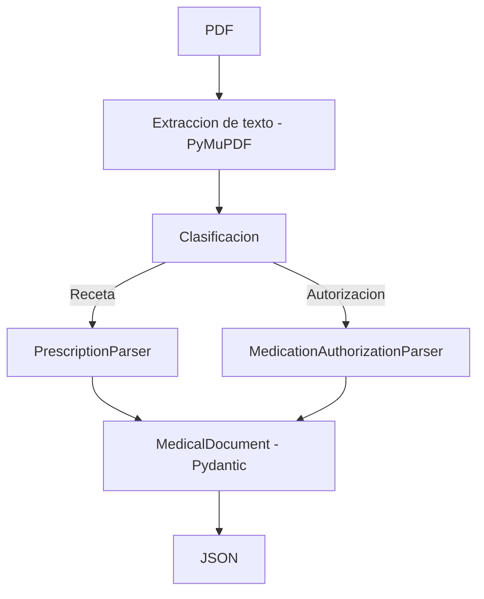

# Medical PDF Parser

Extractor y parser incremental de documentos medicos en PDF, con soporte actual para recetas y autorizaciones de medicamentos.

Esta prueba fue desarrollada de manera incremental. En lugar de intentar resolver todos los formatos desde el inicio, primero construi una base simple para extraer y clasificar documentos, y luego incorpore un parser por vez.

Cada etapa se valido con tests sinteticos y con los PDFs reales. La prioridad fue mantener una solucion explicable y verificable, usando OCR o modelos de IA solo como posibles evoluciones cuando las reglas deterministicas dejaran de ser suficientes.

## Estado Actual

- 2 formatos soportados: recetas y autorizaciones de medicamentos.
- 57 tests pasando en la ultima validacion documentada.
- Extraccion nativa con PyMuPDF.
- Validacion estructurada con Pydantic.
- CLI con salida JSON.
- OCR no implementado.
- LLM no utilizado en runtime.
- Parser tabular basado en heuristicas documentadas.

## Arquitectura



## Estructura del Proyecto

```text
src/
├── extractor.py
├── classifier.py
├── models.py
├── main.py
└── parsers/
    ├── base.py
    ├── prescription.py
    └── authorization.py

tests/
├── test_classifier.py
├── test_extractor.py
├── test_prescription_parser.py
└── test_authorization_parser.py

docs/
├── DECISIONS.md
├── DEVELOPMENT_LOG.md
├── TOOLS.md
└── RETROSPECTIVE.md
```

## Proceso y Herramientas

La entrega incluye documentacion del proceso porque una parte central de la resolucion fue observar, formular hipotesis, validar resultados y corregir interpretaciones, ademas de escribir el codigo.

- [Bitacora de desarrollo](docs/DEVELOPMENT_LOG.md)
- [Decisiones tecnicas](docs/DECISIONS.md)
- [Herramientas utilizadas](docs/TOOLS.md)
- [Retrospectiva](docs/RETROSPECTIVE.md)

## Instalacion

Requisitos:

- Python 3.11 o superior
- Windows PowerShell

Crear y activar entorno virtual:

```powershell
python -m venv .venv
.\.venv\Scripts\Activate.ps1
```

Instalar dependencias:

```powershell
pip install -r requirements.txt
```

## Uso

Ejecutar con una receta:

```powershell
python -m src.main .\1.pdf
```

Ejecutar con una autorizacion:

```powershell
python -m src.main .\2.pdf
```

Ambos comandos devuelven un `MedicalDocument` serializado como JSON.

Ejemplo conceptual:

```json
{
  "document_type": "prescription",
  "patient": {
    "name": "Nombre del paciente",
    "dni": "12345678",
    "cuil": null,
    "birth_date": "1980-01-15",
    "gender": "Femenino"
  },
  "professional": {
    "name": "Nombre profesional",
    "license": "12345"
  },
  "medications": [
    {
      "name": "Medicamento",
      "active_ingredient": null,
      "dosage": "500 MG",
      "presentation": "Comprimidos x 30",
      "quantity": 1.0,
      "instructions": "Indicacion textual",
      "coverage_percentage": null
    }
  ],
  "diagnosis": "Diagnostico textual",
  "issued_at": "2026-07-14",
  "valid_until": null,
  "warnings": []
}
```

## Parsers

### Recetas

El parser de recetas usa etiquetas del documento y estructura cercana, no valores concretos del PDF.

Extrae datos de paciente, profesional, medicamento principal, diagnostico, fecha de emision e indicaciones.

Decisiones relevantes:

- `Fecha de vigencia` no se mapea a `valid_until` porque en `1.pdf` pertenece al bloque profesional.
- CUIL se acepta solo si, al quitar guiones y espacios, quedan 11 digitos.
- `Marca sugerida` no se mezcla con el nombre del medicamento.
- Los reemplazos de texto solo se hacen para patrones conocidos y verificables.

### Autorizaciones

El parser de autorizaciones trabaja sobre una tabla que PyMuPDF extrae como una secuencia de lineas.

Extrae paciente desde `AFILIADO:`, profesional desde `MEDICO SOLICITANTE:`, diagnostico, fechas, medicamento autorizado, monodroga, dosis, presentacion, cobertura y cantidad.

Limitaciones del parseo tabular:

- reconstruye filas usando encabezados, limites y patrones numericos;
- soporta el caso observado y textos sinteticos similares, incluyendo mas de una fila simple;
- no cubre tablas complejas con celdas largas partidas de forma ambigua.

## Warnings

La salida no agrega warnings por cualquier `null`.

- Ausencia esperable de un campo opcional: `null` sin warning.
- Campo presente pero invalido: `null` o valor conservado con warning.
- Estructura importante que no se puede reconstruir: warning.
- Documento incompatible con el parser: excepcion y mensaje claro.

## Tests

```powershell
pytest
```

Los tests no dependen de los PDFs reales para cubrir la logica principal. Usan textos sinteticos y PDFs temporales generados con PyMuPDF.

## Limitaciones

- Los parsers cubren los formatos observados, no todos los formatos posibles.
- El parseo tabular de autorizaciones es heuristico.
- No usa OCR.
- No usa LLMs en runtime.
- Soporta filas simples de medicamentos; los casos tabulares complejos siguen siendo limitados.
- No hace validacion clinica ni normalizacion farmacologica.
- En produccion no deberian registrarse datos medicos sensibles en logs.

## Posibles Evoluciones

Estas son evoluciones posibles, no funcionalidades actuales:

- OCR como fallback para documentos escaneados.
- Evidencia del texto fuente asociada a cada campo.
- Nivel de confianza por extraccion.
- Revision humana para campos ambiguos.
- Parser hibrido con LLM para formatos desconocidos.
- Soporte para nuevos tipos de documentos medicos.

## Conclusion

El objetivo de esta prueba no fue solamente extraer informacion desde PDFs, sino convertir documentos medicos con estructuras diferentes en un modelo comun sin completar datos sin evidencia.

Durante la implementacion priorice comprender el problema, validar cada hipotesis y corregir interpretaciones antes de incorporar tecnologias mas complejas. Para los documentos actuales, la extraccion nativa y las reglas deterministicas resultaron suficientes.

La documentacion incluida refleja tanto el resultado final como el proceso seguido para llegar a el.
